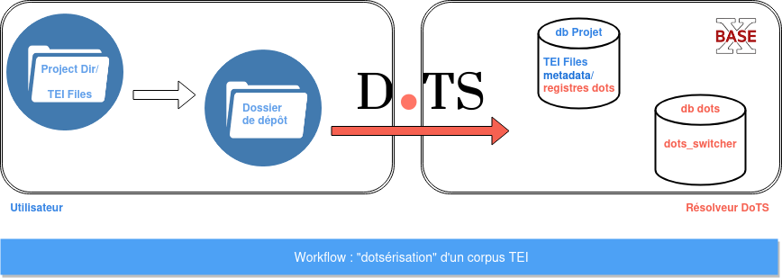

# Publier un corpus avec DoTS


Pour publier un projet, il suffit de charger un *dossier de dépôt* conforme aux recommandations DoTS.

Cette page décrit le *worflow* de publication, les recommandations DoTS de structuration de ce *dossier de dépôt*, et la procédure de création et gestion d'un *projet*.


## Introduction

### Vocabulaire

**Projet**. Un "projet" est une collection DTS de premier niveau, un corpus éditorial défini. Par exemple, il est possible de donner accès via un même endpoint DTS à des correspondances ET à des pièces de théâtre : on distinguera donc le projet *Correspondance* et le projet *Théâtre*.


**Dossier de dépôt**. Pour être correctement chargé en base avec les outils DoTS, un *projet* doit être structuré dans un dossier conformément aux recommandations de DoTS. Ce dossier est désigné dans la documentation par l’expression "dossier de dépôt".

**Base de données projet** ou **DB projet**. Chaque *projet* (chaque collection DTS de premier niveau) est importé sous la forme d’une base de données BaseX. Les projets *Correspondance* et *Théâtre* sont chargés sous la forme de 2 bases de données distinctes, par exemple respectivement `correspondance` et `theatre`.


### Workflow




???+ note

    NB. Idéalement le dossier de dépôt est le dossier de travail.


## Préparer les données

### Préparer le dossier de dépôt

Un [Dossier de dépôt](dots-project-folder.md) contient :

- obligatoirement les sources XML/TEI du projet (dossier `data/`), organisées selon la hiérarchie de votre choix,
- optionnellement les métadonnées décrivant les collections et les documents (dossier `metadata/`), avec *a minima* le document XML `dots_metadata_mapping.xml`,
- optionnellement un `README.md` documentant le dossier de dépôt.


???+ info "Modèle"

	```
	nom_projet/							# Racine du dossier de dépôt
		data/							# OBLIGATOIRE. Fichiers TEI en dossiers de collection
			collection_1/				# Collection 1
				file_1.xml				# file_1 appartient par défaut à la collection 1
				file_2.xml				# idem
			collection_2/				# Collection 2
				file_100.xml			# file_100 appartient par défaut à la collection 2
				file_101.xml			# idem
		metadata/						# OPTIONNEL. Métadonnées des collections et des documents
			dots_metadata_mapping.xml	# Déclaration du chemin des métadonnées
			metadata_1.tsv				# Un fichier de métadonnées
			metadata_2.tsv				# idem
		README.md						# OPTIONNEL. Documentation (plan de nommage, etc.)
	```


<!--
- Racine du projet – `nom_projet/`. Le nom de ce dossier est libre. Au chargement en base, vous pourrez spécifier le nom de la base de données BaseX, et l’identifiant DTS attribué à la collection racine. Vous pourrez aussi lui attribuer un titre.

- Les documents XML/TEI – `data/`. Ce dossier est **obligatoire**. Il contient les sources XML/TEI de votre *<a>projet</a>* organisées selon la hiérarchie de votre choix. Cette hiérarchie représente les collections par défaut de votre *projet*. Par exemple, ici, les documents `file_1.xml` et `file_2.xml` appartiennent à la collection `collection_1`.

- Les métadonnées – `metadata/`. Ce dossier est **optionnel**. S'il est présent, il doit contenir *a minima* un document XML `dots_metadata_mapping.xml` qui permet de déclarer finement où se trouvent les métadonnées de collections et / ou de documents. 
-->

### Préparer les [passages](dots-project-folder/#passages)

L'utilisateur peut décrire la structure de chacun de ses documents et définir l'accès aux fragments à l'intérieur.

Il doit pour cela faire usage de l'élément TEI [`tei:citeStructure`](https://tei-c.org/release/doc/tei-p5-doc/en/html/ref-citeStructure.html).


### Exemples

**Liens au cookbook :**

- [périodiques](cookbook.md/#publier-un-periodique)
- cartulaire / registre
- théâtre
- correspondance
- roman
- poésie
- dictionnaire


## Charger un projet

### Initialisation de la DB dots


```Bash
cd path/to/basex/bin
bash basex ../webapp/dots/scripts/dots_db_init.xq
```

Cette première commande permet d'initialiser la base de données dots. Elle sert à relier chaque ressource identifiée à sa base de données *projet* d'appartenance.

### Création de la base de données *projet*


```Bash
cd path/to/basex/bin
bash basex -b dbName=db_name -b projectDirPath=/path/to/dossier/de/depot ../webapp/dots/scripts/project_db_init.xq
```

Cette commande permet de créer automatique la base de données *projet*.
On doit spécifier les arguments suivants :

- `dbName` : nom de la base de données BaseX du *projet*
- `projectDirPath` : chemin absolu vers le *dossier de dépôt* du projet

La base de données *projet* est créée en conservant la structure du paquet de dépôt en collections et sous-collection. 

### Création des registres du *projet*

???+ note

	**La base de données du *projet* ne DOIT PAS être ouverte dans le GUI BaseX.**

```Bash
bash basex -b dbName=db_name -b topCollectionId=top_collection_id ../webapp/dots/scripts/project_registers_create.xq
```

Cette commande permet de créer les registres dots dans la base de données *projet*. Ce sont ces registres qui fournissent les éléments de réponse au résolveur.

On doit spécifier les arguments suivants :

- `dbName` : nom de la base de données BaseX du *projet*
- `topCollectionId` : identifiant DTS de la collection racine du *projet*

### Mise à jour du switcher DoTS

???+ note

	**La mise à jour du switcher dots doit être réalisée après la création des registres du projet (commande précédente).**

```Bash
bash basex -b dbName=db_name ../webapp/dots/scripts/dots_switcher_update.xq
```

Le switcher de la base de données DoTS (`dots_db_switcher.xml`) sert à associer les identifiants des ressources (collections et documents) à leur base de données de *projet* d’appartenance.

On doit spécifier l’argument suivant :

- `dbName` : nom de la base de données BaseX du *projet* à parcourir pour mise à jour du switcher. Ainsi, on peut mettre à jour la base pour un unique *projet*.

Et voilà. Les ressources de votre projet sont décrites et accessibles via les endpoints DTS fournis par DoTS. La description des réponses d'API est disponible à cette adresse: [résolveur](resolver).


## Gérer un projet

### Créer de nouvelles collections et y attacher des documents (existants)


```Bash
bash basex -b srcPath=/path/to/custom_collections.tsv ../webapp/dots/scripts/create_custom_collections.xq 
```

Le fichier `custom_collections.tsv` illustre comment créer de nouvelles collections et lier des documents (déjà existants) à ces collections.

Plus d'informations sont disponibles à cette adresse: [dossier de dépôt](dots-project-folder.md/#autres-collections).


### Supprimer les registres DoTS d’un projet

???+ note

	**Attention :** après avoir utilisé cette commande, le résolveur `dots` ne fournit plus de réponse d'API pour ce *projet*.

```Bash
bash basex -b dbName=db_name  -b option=true / false../webapp/dots/scripts/dots_registers_delete.xq
```

Cette commande permet de supprimer toutes les ressources qui appartiennent à la *base de données projet* dans le switcher de la db `dots`. 

Si la valeur du paramètre `option` est `true`, elle permet aussi de supprimer la *base de données projet* ; elle se contente sinon de supprimer ses registres dots.

On doit spécifier les arguments suivants :

- `dbName` : nom de la base de données BaseX du projet à parcourir suppression des registres DoTS.
- `option` : valeur booléenne. `true` permet de supprimer la base de données *projet* et `false` se contente de supprimer les registres `dots` du *projet*. 

